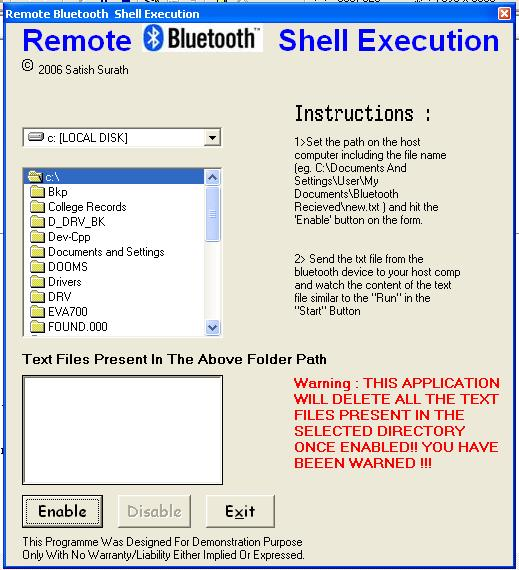



## remote bluetooth shell execution

### Description

This Applications give you the ability to a particular command on the hosts's computer from your cell phone.
 
### More Info
 

             |
---                |---
**Submitted On**   |2006-01-21 17:00:08
**By**             |[Satish Surath](https://github.com/Planet-Source-Code/PSCIndex/blob/master/ByAuthor/satish-surath.md)
**Level**          |Intermediate
**User Rating**    |3.5 (14 globes from 4 users)
**Compatibility**  |VB 5\.0, VB 6\.0
**Category**       |[Complete Applications](https://github.com/Planet-Source-Code/PSCIndex/blob/master/ByCategory/complete-applications__1-27.md)
**World**          |[Visual Basic](https://github.com/Planet-Source-Code/PSCIndex/blob/master/ByWorld/visual-basic.md)
**Archive File**   |[remote\_blu1966941212006\.zip](https://github.com/Planet-Source-Code/satish-surath-remote-bluetooth-shell-execution__1-64100/archive/master.zip)

